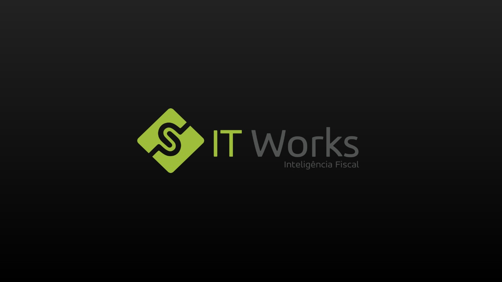
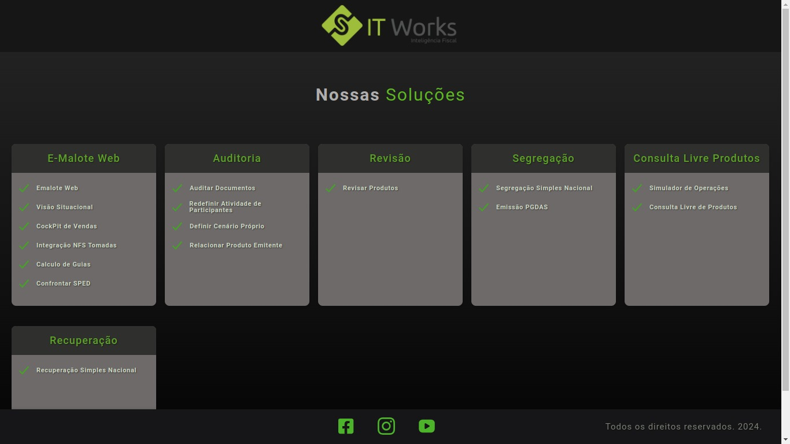
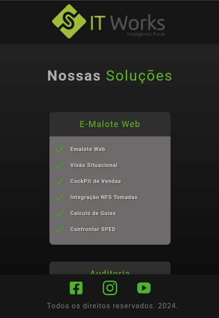
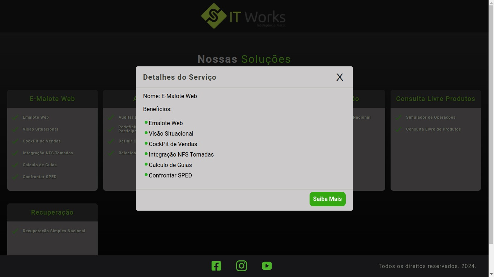
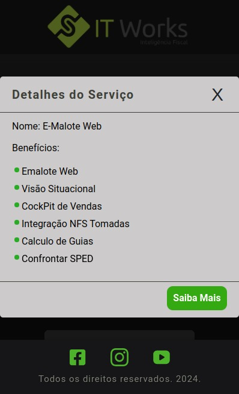

# Projeto It Works Front End
A aplicação frontend é construída com React, utilizando Vite como ferramenta de desenvolvimento. Renderiza os dados de uma API JSON, apresentando informações detalhadas sobre os módulos e submódulos de serviços da empresa de forma organizada e acessível aos usuários. Possuindo uma opção de descrição detalhada ao interagir com o serviço específico.

# Versão Demo - Deploy 
[Link do projeto]([https://projeto-it-works-front.vercel.app/])

# Como funciona?
Este projeto é uma aplicação front-end desenvolvida em React com Vite, destinada a exibir e gerenciar informações de módulos de serviços. A aplicação apresenta uma tabela dinâmica de soluções com opção de descrição detalhada, permitindo aos usuários priorizar dados de um serviço específicos ao selecioná-lo, proporcionando uma experiência de usuário personalizada. Além disso, a aplicação é responsiva, adaptando-se de forma fluida tanto para dispositivos web quanto móveis, garantindo uma experiência consistente em todas as plataformas.

#### Tela Principal - Tabela de Serviços
- Apresenta os dados de todos os serviços disponíveis nos módulos;
- Caso um card de serviço seja selecionado, a tabela exibe uma descrição específica ao usuário;
- Em caso de falha na busca de dados, é exibido um alerta informando o erro para o usuário;
- Os dados exibidos são: Nome do Serviço e uma lista com os benefícios de contratação do mesmo;

#### Seleção de Serviço - Descrição específica
- Ao Selecionar um serviço é possível ter um foco maior no benefícios que o acompanham;
- Se o usuário se interessar em saber mais, pode clicar no botão presente na tabela e navegar pelo site oficial da It Works;
- Em caso de falha é exibido um alerta informando o erro para o usuário;

Currently, two official plugins are available:

- [@vitejs/plugin-react](https://github.com/vitejs/vite-plugin-react/blob/main/packages/plugin-react/README.md) uses [Babel](https://babeljs.io/) for Fast Refresh
- [@vitejs/plugin-react-swc](https://github.com/vitejs/vite-plugin-react-swc) uses [SWC](https://swc.rs/) for Fast Refresh
# projeto-it-works-front
